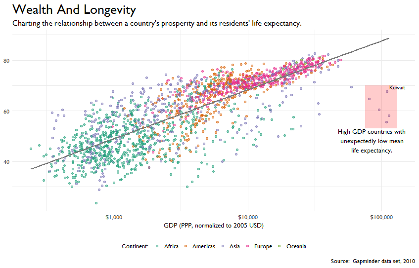

<style>
.reveal section img { background:none; border:none; box-shadow:none; }
</style>

## Machine Learning with .NET

<a href="https://www.catallaxyservices.com">Kevin Feasel</a> (<a href="https://twitter.com/feaselkl">@feaselkl</a>)
<a href="https://csmore.info/on/dotnetml">https://CSmore.info/on/dotnetml</a>

---

@title[Who Am I?]

@div[left-60]
<table>
	<tr>
		<td><a href="https://csmore.info"></a></td>
		<td><a href="https://csmore.info">Catallaxy Services</a></td>
	</tr>
	<tr>
		<td><a href="https://curatedsql.com"></a></td>
		<td><a href="https://curatedsql.com">Curated SQL</a></td>
	</tr>
	<tr>
		<td><a href="https://www.apress.com/us/book/9781484254608"></a></td>
		<td><a href="https://www.apress.com/us/book/9781484254608">PolyBase Revealed</a></td>
	</tr>
</table>
@divend

@div[right-40]
	<br /><br />
	<a href="https://www.twitter.com/feaselkl"></a>
	<br />
	<a href="https://www.twitter.com/feaselkl">@feaselkl</a>
</div>
@divend

---

### Process

@div[left-50]

@divend

@div[right-50]
In today's talk, we will apply the Microsoft Team Data Science Process to solving a problem using ML.NET.
@divend

---?image=presentation/assets/background/typewriter.jpg&size=cover&opacity=20

### The Language Divide

The classic languages for data science are R and Python, along with a few others like SAS and Matlab.  Microsoft has made some inroads in R and fewer in Python, but .NET developers have historically had relatively few tools for training and implementing data science models.

Microsoft is working to fix that with <a href="https://dotnet.microsoft.com/apps/machinelearning-ai/ml-dotnet">ML.NET</a>.

---?image=presentation/assets/background/motivation.jpg&size=cover&opacity=20

### Motivation

We will use the Team Data Science Process and ML.NET to estimate Bills victories from 2018.


---

@title[Business Understanding]

## Agenda

@div[left-50]
1. **Business Understanding**<br />
2. Data Processing<br />
3. Modeling<br />
4. Deployment<br />
5. What's Next?
@divend

@div[right-50]

@divend

---?image=presentation/assets/background/business_understanding.jpg&size=cover&opacity=20

### Business Understanding

Somebody higher up (typically on the business side of the house) wants a data science project done.  Your mission is to figure out as much about that person's vision as possible.

Your domain knowledge will be critical to success, but you should still find the champion(s) of your project and understand best their vision of success.

---?image=presentation/assets/background/questions.jpg&size=cover&opacity=20

### Ask Questions

When interviewing your project champion or people on the business side, listen for the following types of questions:

* How much / how many?
* Which category does this belong to?
* How can we segment this data?
* Is this weird?
* Which option should I choose?

These questions help you determine which algorithms to use.

---?image=presentation/assets/background/problem.jpg&size=cover&opacity=20

### Get A Specific Problem

Your goal is to nail down a **specific** problem, narrowing the scope to something achievable.

* Find a model which predicts quarterly sales to within 5% no later than 30 days into that quarter.
* Given a title and description for a product, tell me with at least 90% probability a listing category that Amazon will consider valid for this product.
* Determine which factors most affect the number of years the first owner holds onto our mid-range sedan.

---?image=presentation/assets/background/looking_for_data.jpg&size=cover&opacity=20

### Looking For Data

Once you have an interesting question, start looking for data. Some of this data will be in-house and could be in databases, Excel, flat files, accessible through APIs, or even in reports.

Your champion will hopefully be able to point you in the right direction, but this part of the process requires legwork.

---?image=presentation/assets/background/dictionary.jpg&size=cover&opacity=20

### Data Dictionary

Once you have a compendium of data sources, you will want to build a <strong>data dictionary</strong>, which helps you explain what different pieces of data actually mean.  A data dictionary typically tells you:

* Data type:  numeric, string, categorical, binary
* Data format:  CSV, SQL Server table, Hive table, etc.
* Size of data and number of records
* Enumeration of valid values (if categorical)
* Other domain rules (if known)

---?image=presentation/assets/background/warehouse.jpg&size=cover&opacity=20

### End Result

Another thing to determine is, where does your end data need to be? Will there be a different engineering team expecting to call a microservice API?  Will you get a set of files each day and dump results into a warehouse?

This is generally a technical problem that an Engineering group will architect, although your champion might have insight here depending upon how the business side will need to use your results.

---

### Example

Some of us had to experience the 2018 Bills season.  Let's see what we can learn from it.


---?image=presentation/assets/background/example_questions.jpg&size=cover&opacity=20

### Example

Questions based on our domain knowledge:

* **How much** money does Charles Clay make not to catch that ball?
* **Which category** of outcome (win, loss, tie) is most likely for a particular roster configuration?
* **How can we segment** the Bills victories?
* Is it **weird** that Kelvin Benjamin is built like a power forward but plays like Muggsy Bogues in leg irons?
* **Which free agent signing** will help end the pain?

---?image=presentation/assets/background/connection.jpg&size=cover&opacity=20

### Example

Our company wants to build a small website and allow Bills fans to commiserate by seeing whether the team would probably win or lose given certain circumstances.  Our job is to build a model in .NET and expose it through an MVC website.

---

@title[Data Processing]

## Agenda

@div[left-50]
1. Business Understanding<br />
2. **Data Processing**<br />
3. Modeling<br />
4. Deployment<br />
5. What's Next?
@divend

@div[right-50]

@divend

---

### Data Processing

Data processing is made up of a few different activities:

* Data Gathering
* Data Cleansing
* Data Analysis

---?image=presentation/assets/background/problem.jpg&size=cover&opacity=20

### A Big Problem

.NET languages are pretty bad about data processing, especially data analysis.  We will go through these examples but I would recommend trying out R or Python for this phase.  F# is an acceptable language for data processing but even it isn't fantastic.  You'd often have a better time of it pulling data into SQL and Excel, and then implementing in .NET.

---?image=presentation/assets/background/collection.jpg&size=cover&opacity=20

### Data Gathering

Data gathering will likely be an iterative process; as you flesh out your models and gain a better understanding of the problem, you will likely search several times for data from sources like:

* Internal proprietary data
* Open data sources (often governmental or academic)
* Paid APIs or data sources from third parties
* Survey data

---?image=presentation/assets/background/map.jpg&size=cover&opacity=20

### Data Gathering Example

In this example, we will use Pro Football Reference to get high-level measures like score, location, top receiver, etc. If you want to take this further, a few additional data sources could be:

* Las Vegas odds prior to the game.
* Advanced analytics for players on both sides.
* Weather data.
* Coaching and schema data.
* Additional historical data on combinations of players to estimate team quality.

---?image=presentation/assets/background/tags.jpg&size=cover&opacity=20

### Labels and Features

Most of the time, we perform **supervised** learning, which has two key terms:  **features** and **labels**.

**Features** are the columns you have available for prediction.  These can come from multiple sources and be the end product of a lot of ETL.  Example features can include number of yards rushing or passing, number of defensive turnovers, etc.

The **label** is the column you want to predict, and you have historical data.  For example, our label is whether the Bills won the game or not.

---?image=presentation/assets/background/cleaning.jpg&size=cover&opacity=20

### Data Cleansing

General estimates that you will hear from data scientists is that they spend approximately 80% of their time cleaning data. If anything, this is an underestimation--based on my experiences, that number might be closer to 90%.

Simply getting the data is a start, but there's a long journey ahead.

---?image=presentation/assets/background/datatypes.jpg&size=cover&opacity=20

### Data Cleansing

Common data cleansing activites include (but certainly are not limited to):

* Correcting mislabled data
* Dealing with missing data
* Dealing with data inconsistencies
* Reshaping data

---?image=presentation/assets/background/mismatch.jpg&size=cover&opacity=20

### Data Cleansing - Mismatches

**Mislabeled** data:  when the label is incorrect.  Ex: on the team data, we might have the Bills scoring 33 points when they really scored 3. If you can fix the label, this data becomes useful. If you cannot, it may throw off your analysis.

**Mismatched** data:  data joined together which should not have been.
							
**Incorrect** data: when data other than the label is incorrect. Ex: Kelvin Benjamin actually caught a ball?

---?image=presentation/assets/background/hole.jpg&size=cover&opacity=20

### Data Cleansing - Missing Data

People don't always fill out the entirety of every form. When we're missing important data, we have a few options available to us:

* Delete the row (okay with a small percent)
* Substitute with a dummy value
* Substitute with the mean, median, or mode
* Use regression and replace with the regressed value

None of these options is perfect, but the last three can help salvage incomplete records.

---

### Data Inconsistencies

Independent systems may end up with inconsistent data due to reasons like typos, transcription errors, etc. Sometimes subtle differences in data sets can lead to differing results. Potential solutions include:
* Make one data set canonical
* Institute rules (pick the lower number, pick the later date, etc.)

---?image=presentation/assets/background/shapes.jpg&size=cover&opacity=20

### Data Shaping

There are several techniques we can use to reshape data to make it easier to analyze:

* Vectorize words (turn each word into a number)
* Turn strings into factors (categorical data)
* Normalize values (transform numeric data to have a mean of 0 and standard deviation of 1)
* Bin data, converting continuous variables to discrete

---?image=presentation/assets/background/exploration.jpg&size=cover&opacity=20

### Data Analysis

The most common technique for data analysis at this point is Exploratory Data Analysis (EDA). Examples of EDA techniques include:

* Getting count and cardinality of features
* Building out 5-number summaries
* Visualizing data, especially with box plots and histograms
* Determining correlation between variables

---

### Data Analysis - Cardinality

@div[left-50]

@divend

@div[right-50]
The cardinality of a feature is the number of unique values.
@divend

---

### Data Analysis - 5-Number Summary

The five-number summary of a feature tells us the minimum value, value at the 25% mark, value at the 50% mark, value at the 75% mark, and maximum value. The mean technically is not part of the five-number summary, but can be useful.


---

### Data Analysis - Box Plot

Box plots show us the five-number summary by group.


---

### Data Analysis - Histogram

Histograms show us the spread of a single variable.


---

### Data Analysis - Correlation

Here we have two comparisons, depth vs table and x vs y. Depth and table are mildly negatively correlated; this isn't a problem. The x and y variables, however, are very highly correlated. Some algorithms may exhibit problems if you include both x and y in your analysis.


---

@title[Modeling]

## Agenda

@div[left-50]
1. Business Understanding<br />
2. Data Processing<br />
3. **Modeling**<br />
4. Deployment<br />
5. What's Next?
@divend

@div[right-50]

@divend

---?image=presentation/assets/background/model.jpg&size=cover&opacity=20

### Modeling

Modeling has five major steps:

* Feature Engineering
* Feature Selection
* Model Selection & Training
* Model Evaluation
* Model Tuning

---

```csharp
var mlContext = new MLContext();
var reader = mlContext.Data.CreateTextLoader(
    columns: new TextLoader.Column[]
    {
        // The four features of the Iris dataset will be grouped together as one Features column.
        new TextLoader.Column("SepalLength",DataKind.R4,0),
        new TextLoader.Column("SepalWidth",DataKind.R4,1),
        new TextLoader.Column("PetalLength",DataKind.R4,2),
        new TextLoader.Column("PetalWidth",DataKind.R4,3),
        // Label: kind of iris.
        new TextLoader.Column("Label",DataKind.TX,4)
    },
    // Default separator is tab, but the dataset has semicolon.
    separatorChar: ',',
    // First line of the file is a header, not a data row.
    hasHeader: true
);
var data = reader.Read(dataPath);
```

@[1](Create a new Machine Learning context.)
@[2-17](Define the shape of input data.)
@[18](Load the data from dataPath.)


---?image=presentation/assets/background/engineering.jpg&size=cover&opacity=20

### Feature Engineering

Feature engineering involves creating relevant features from raw data. Examples include:

* Indicator flags (Age >= 21, Income >= $100K)
* Calculations (ClickThroughRate = Clicks / Impressions)
* Geocoding latitude and longitude from an address
* Aggregating data (by day, by hour, etc.)
* Text processing -- turning words into arbitrary numbers for numeric analysis (TF-IDF, Word2Vec)

---

```csharp
var dynamicPipeline =
    // Concatenate all the features together into one column 'Features'.
    mlContext.Transforms.Concatenate("Features", "SepalLength",
		"SepalWidth", "PetalLength", "PetalWidth")
	// Drop unnecessary features
	.Append(mlContext.Transforms.DropColumns(new[]
		{ "UnusedValue", "OtherUnusedValue" }))
    // Note that the label is text, so it needs to be converted to key.
    .Append(mlContext.Transforms.Conversion.MapValueToKey("Label"),
		TransformerScope.TrainTest)
    // Use the multi-class SDCA model to predict the label using features.
    .Append(mlContext.MulticlassClassification.Trainers.
		SdcaNonCalibrated());
```

@[1](Create a new pipeline.)
@[2-4](Engineer a new feature called Features as a vector of floats.)
@[8-10](Reshape the label to turn it into a key for multiclass training.)

---?image=presentation/assets/background/selection.jpg&size=cover&opacity=20

### Feature Selection

We use feature selection to winnow down the available set of features.  There are several reasons to do this:

* Collinearity -- one feature can predict another, making analysis less precise.
* Make analysis easier for a human to understand by removing irrelevant or redundant features.
* More efficient training with fewer variables.
* Reduce the risk of an irrelevant or redundant feature causing spurious correlation.

---

### Spurious Correlation


(<a href="http://www.tylervigen.com/spurious-correlations">Source</a>)

---

```csharp
var dynamicPipeline =
    // Concatenate all the features together into one column 'Features'.
    mlContext.Transforms.Concatenate("Features", "SepalLength",
		"SepalWidth", "PetalLength", "PetalWidth")
	// Drop unnecessary features
	.Append(mlContext.Transforms.DropColumns(new[]
		{ "UnusedValue", "OtherUnusedValue" }))
    // Note that the label is text, so it needs to be converted to key.
    .Append(mlContext.Transforms.Conversion.MapValueToKey("Label"),
		TransformerScope.TrainTest)
    // Use the multi-class SDCA model to predict the label using features.
    .Append(mlContext.MulticlassClassification.Trainers.
		SdcaNonCalibrated());
```

@[5-7](Perform feature selection and drop unused features.)

---?image=presentation/assets/background/train.jpg&size=cover&opacity=20

### Model Training

We take some percentage of our total data and designate it for training / validation, and the remainder is for evaluation. There are no hard rules on percentages, but typically, we reserve 70-80% for training.

There are four major branches of algorithms:
* Supervised learning
* Unsupervised learning
* Self-supervised learning
* Reinforcement learning

---?image=presentation/assets/background/supervision.jpg&size=cover&opacity=20

### Supervised Learning

Supervised learning models require known answers (labels). We train a model to map input data to those labels in order to have the model predict the correct answer for unlabeled records. Major classes of supervised learning models and their pertinent driving questions include:

* Regression -- How much?
* Classification -- Which?
* Recommendation -- What next?

---?image=presentation/assets/background/cluster.jpg&size=cover&opacity=20

### Unsupervised Learning

With unsupervised learning, we do not know the answers beforehand and try to derive answers. We can use unsupervised learning to drive toward a supervised problem by giving data analysts insight into the nature of the problem. Major classes of unsupervised learning models and their pertinent driving questions include:

* Clustering -- How can we segment?
* Dimensionality reduction -- What of this data is useful?

---?image=presentation/assets/background/book.jpg&size=cover&opacity=20

### Self-Supervised Learning

This is a subset of supervised learning, but with the popularity of neural networks, has come into its own. We use heuristics to guesstimate labels and train the model that way. An example of self-supervised learning is predicting the next word in a document based on previous words.

Self-supervised learning typically happens with neural networks.

---

### Reinforcement Learning

@div[left-50]

@divend

@div[right-50]
Reinforcement learning is where we train an agent to observe its environment and use those environmental clues to make a decision.
@divend

---?image=presentation/assets/background/greenscreen.jpg&size=cover&opacity=20

### Choose An Algorithm

Once you understand the nature of the problem, you can choose among viable algorithms based on the following major trade-offs:

* Accuracy
* Training time
* Ability to understand the result
* Number of parameters
* Number of features allowed

---


---

### Algorithms

@div[left-50]

@divend

@div[right-50]
Once you have an algorithm, features, and labels (if supervised), you can train the algorithm. Training a model is solving a system of equations, minimizing a loss function.
@divend

---

```csharp
var dynamicPipeline =
    // Concatenate all the features together into one column 'Features'.
    mlContext.Transforms.Concatenate("Features", "SepalLength",
		"SepalWidth", "PetalLength", "PetalWidth")
	// Drop unnecessary features
	.Append(mlContext.Transforms.DropColumns(new[]
		{ "UnusedValue", "OtherUnusedValue" }))
    // Note that the label is text, so it needs to be converted to key.
    .Append(mlContext.Transforms.Conversion.MapValueToKey("Label"),
		TransformerScope.TrainTest)
    // Use the multi-class SDCA model to predict the label using features.
    .Append(mlContext.MulticlassClassification.Trainers.
		SdcaNonCalibrated());
```

@[11-13](Select a multi-class classifier algorithm for training.)

---?image=presentation/assets/background/fitting.jpg&size=cover&opacity=20

### Validate The Model

Instead of using up all of our data for training, we typically want to perform some level of validation within our training data set to ensure that we are on the right track and are not overfitting.

Overfitting happens when a model latches on to the particulars of a data set, leaving it unable to generalize to new data. To test for overfitting, test your model against unseen data. If there is a big dropoff in model accuracy between training and testing data, you are likely overfitting.

---

```csharp
// Split the data 90:10 into train and test sets, train and evaluate.
var split = mlContext.Data.TrainTestSplit(data, testFraction: 0.3);
// Train the model.
var model = dynamicPipeline.Fit(split.TrainSet);
// Compute quality metrics on the test set.
var metrics = mlContext.MulticlassClassification.
	Evaluate(model.Transform(split.TestSet));
Console.WriteLine(metrics.AccuracyMicro);
```

@[1-2](Define a data split for training.  Here it's 90-10.)
@[3-4](Actually perform the model training.)
@[5-8](Evaluate measures and write out the accuracy to the console.)

---?image=presentation/assets/background/suitmeasure.jpg&size=cover&opacity=20

### Cross-Validation

Cross-validation is a technique where we slice and dice the training data, training our model with different subsets of the total data. The purpose here is to find a model which is fairly robust to the particulars of a subset of training data, thereby reducing the risk of overfitting.

---

```csharp
// Now run the 5-fold cross-validation experiment, using the same pipeline.
var cvResults = mlContext.MulticlassClassification.
	CrossValidate(data, dynamicPipeline, numFolds: 5);
// The results object is an array of 5 elements.
// For each of the 5 folds, we have metrics, model and scored test data.
// Let's compute the average micro-accuracy.
var microAccuracies = cvResults.Select(r => r.metrics.AccuracyMicro);
Console.WriteLine(microAccuracies.Average());
```

@[1-3](Perform five-fold cross validation with our data set.)
@[4-8](Write out the mean accuracy of all five folds.)

---?image=presentation/assets/background/tuning.jpg&size=cover&opacity=20

### Tune The Model

Most models have **hyperparameters**. For neural networks, the number of training epochs is a hyperparameter. For random forests, hyperparameters include things like the size of each decision tree and the number of trees.

We tune hyperparameters using our validation data set.

---?image=presentation/assets/background/evaluation.jpg&size=cover&opacity=20

### Evaluate The Model

Model evaluation happens when we send new data to the model that it has not seen during the training and validation process. We have to be careful not to let any information leak into the training data, meaning that we should never feed aggregates of training + evaluation data to a model.

If we fail to safeguard this data, we can end up overfitting our model to the test data, leaving it less suited for the real-world data outside of our sample.

---

### Evaluate The Model

@div[left-50]

@divend

@div[right-50]
You can also build a fitness function to evaluate certain types. Genetic algorithms are a common tool for this.
@divend

---?image=presentation/assets/background/demo.jpg&size=cover&opacity=20

### Demo Time

---

@title[Deployment]

## Agenda

@div[left-50]
1. Business Understanding<br />
2. Data Processing<br />
3. Modeling<br />
4. **Deployment**<br />
5. What's Next?
@divend

@div[right-50]

@divend

---

### Deployment

With ML.NET, deployment is fairly straightforward.  For fast models, you can include them in a web application directly.  For slower models, you might store the trained model in a file and load it into memory at service runtime, then generate predictions against it in real time.

---?image=presentation/assets/background/demo.jpg&size=cover&opacity=20

### Demo Time

---?image=presentation/assets/background/microscope.jpg&size=cover&opacity=20

### Deployment

You can also build a microservice:  a small service dedicated to providing a single answer to a single problem. Most microservices are exposed via web calls, although other forms of interoperation are still possible. This also allows for cross-language interoperation:  when exposing a REST API, it doesn't matter which language I wrote my code in.

---?image=presentation/assets/background/time.jpg&size=cover&opacity=20

### Deployment

SQL Server Machine Learning Services is an alternative to ML.NET, giving .NET develpers the ability to integrate with R, Python, or (as of SQL Server 2019) Java code.  This is great when the input data is already stored in SQL Server. With certain types of models, you can make "real-time" predictions or generate predictions as a batch process and store the results in SQL Server for display.

---

@title[What's Next?]

## Agenda
1. Business Understanding
2. Data Processing
3. Modeling
4. Deployment
5. **What's Next?**

---?image=presentation/assets/background/sinkhole.jpg&size=cover&opacity=20

### What's Next?

After go-live, the job is not complete.

It is important to keep checking the efficacy of models. Model shift happens, where a model might have been good at one point in time but becomes progressively worse over time as circumstances change.

You may also find out that your training/testing data was not truly indicative of real-world data.

---?image=presentation/assets/background/flow.jpg&size=cover&opacity=20

### What's Next?

Occasionally, you will want to take new production data and retrain the model, so keep track of your model's predictions and actual outcomes so you can determine the model's efficacy.

Depending upon your choice of algorithm, you might be able to update the existing model with the latest information, feeding those efficacy results back into the model.

Some algorithms, however, require you to retrain from scratch.

---?image=presentation/assets/background/repetition.jpg&size=cover&opacity=20

### What's Next?

Regardless of model efficacy, you will want to confer with those stakeholders and ensure that your model fits their needs. Then, repeat the process.

In a production scenario, you will start with a Minimum Viable Product (MVP) to gauge interest.  From there, you can expand the base of predictions, increase accuracy, make the service faster, or add new functionality.

---

@title[Wrapping Up]

### Wrapping Up

Over the course of today's talk, we have covered the Microsoft Team Data Science Process as well as a pragmatic implementation of a data science workflow. Following a stable process allows you to maximize the chances of developing a high-quality and effective model.

---

### Wrapping Up

Our implementation tool of choice was ML.NET, Microsoft's official library for machine learning in C# and F#.  I think there are much better tools in R and Python, but if your company forbids using those languages, you can get by with this library.

---

### Wrapping Up

To learn more, go here:  <a href="https://csmore.info/on/dotnetml">https://CSmore.info/on/dotnetml</a>

And for help, contact me:  <a href="mailto:feasel@catallaxyservices.com">feasel@catallaxyservices.com</a> | <a href="https://www.twitter.com/feaselkl">@feaselkl</a>
